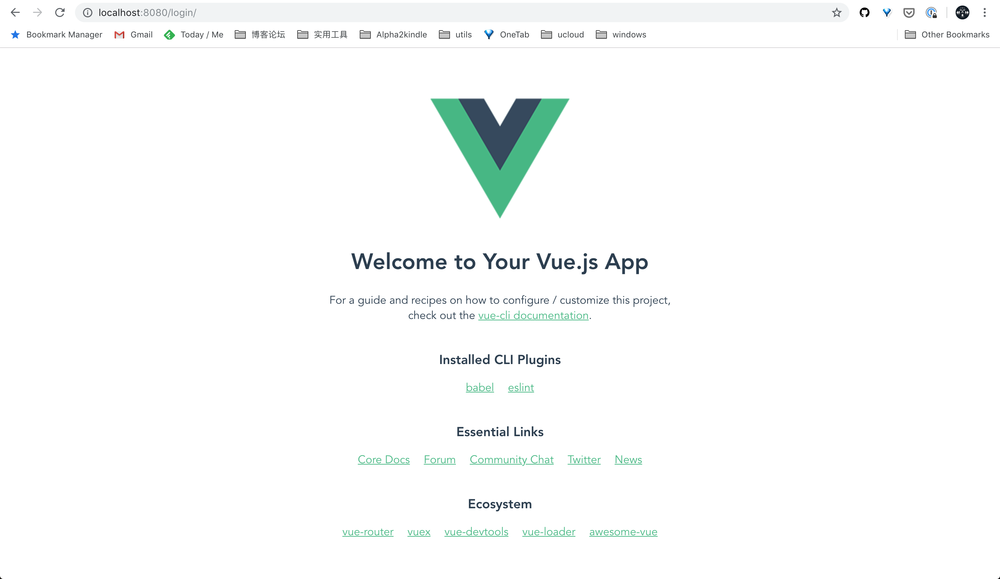
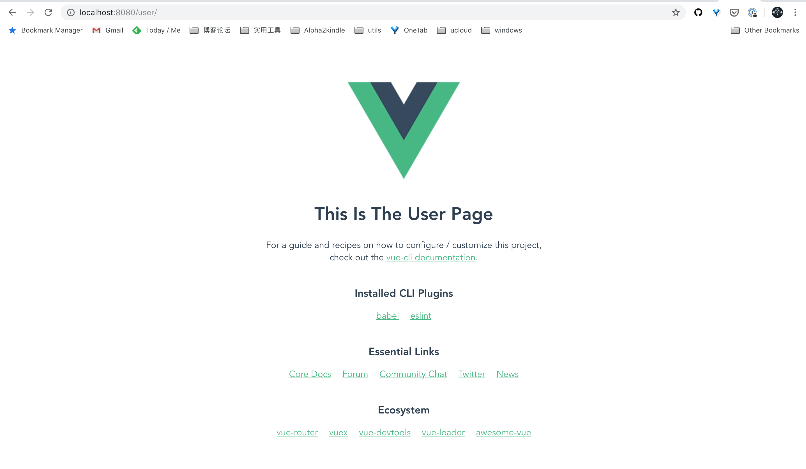
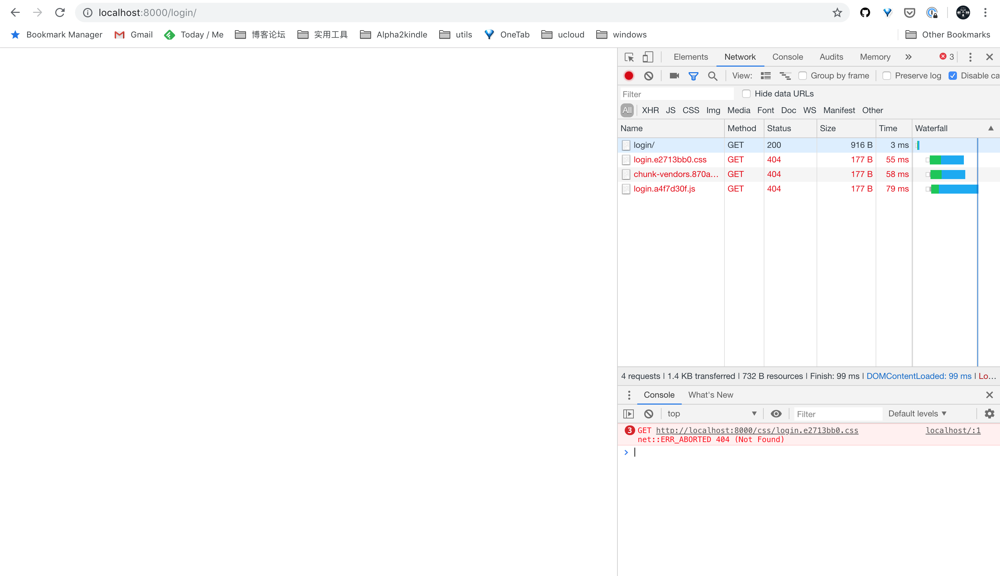
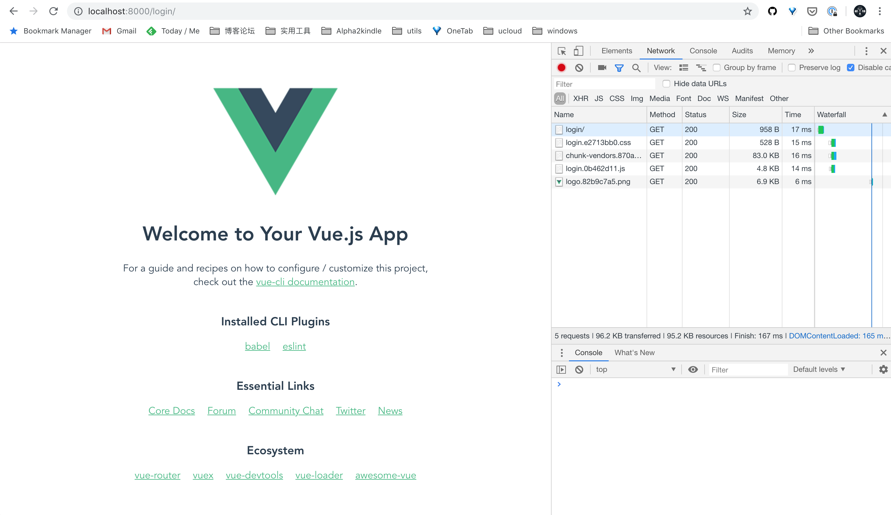
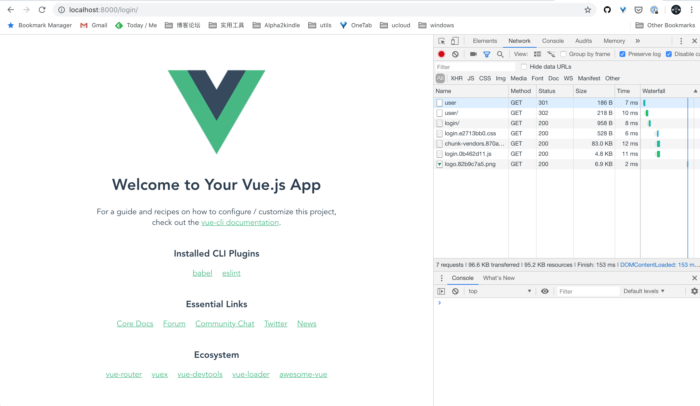
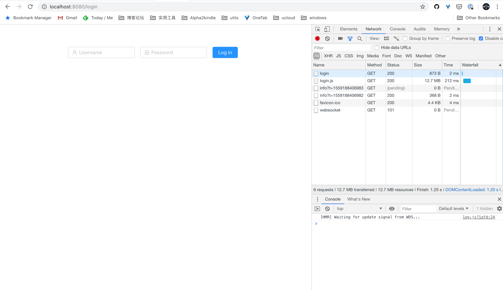
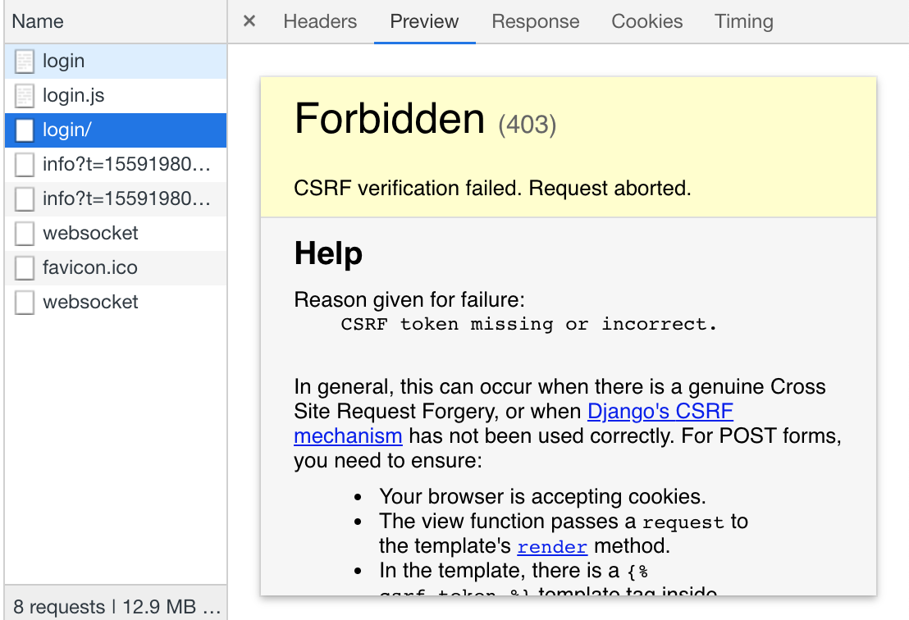
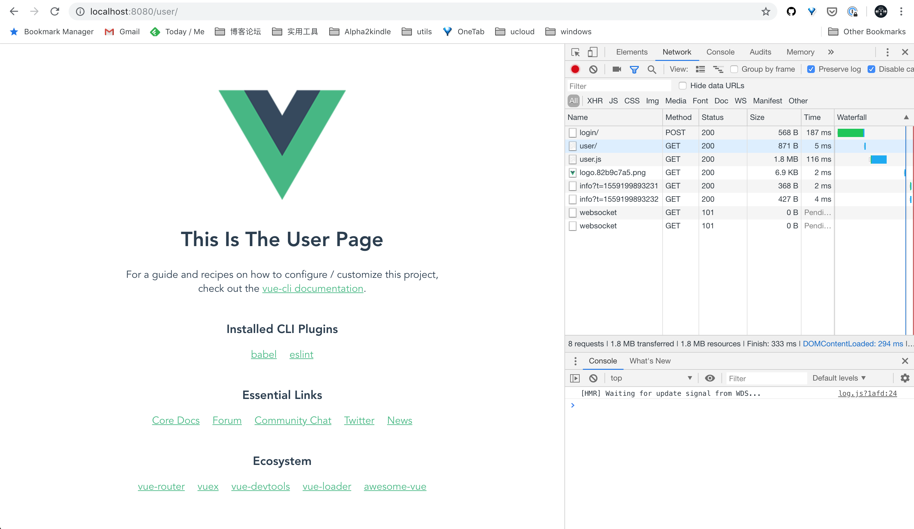
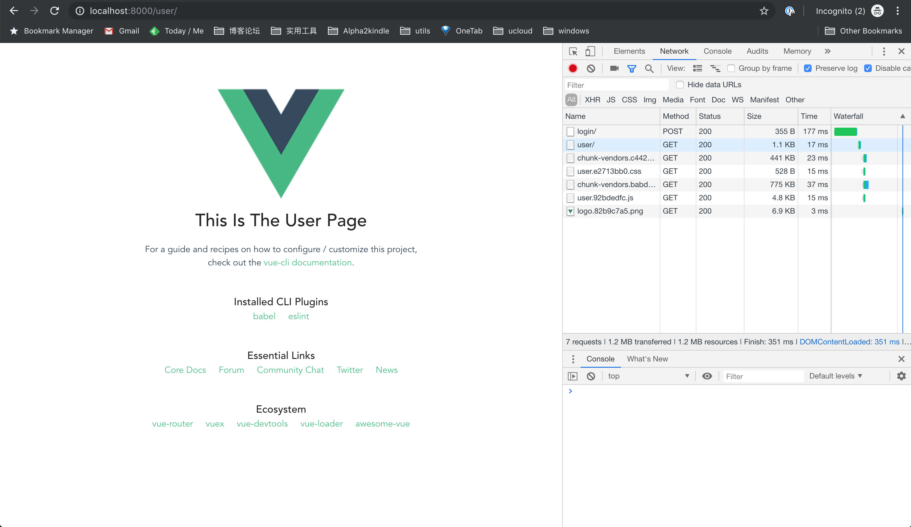

# Intergate Vue in Django

## What Project Will We Build

We want to build a vue project with multiple pages. The Django view render these pages as templates.

## Why We Build Such A Project

If we seperate frond-end and back-end and all routers are handled by the front-end project. The attackers can fake the reponse of authentication and jump to the target pages. If the attackers get the front-end code all in one package without authentication, they can parse out API easily.

So we consider to use front-end service to control the router and use back-end for access control.

## Initial Repository

```shell
mkdir vid && cd vid
git init
```

## Create Virtual Environment

### Specify Python Version

```shell
pipenv --python ~/.pyenv/versions/3.7.1/bin/python3.7
```

### Change Mirror (Optional)

```
[[source]]
name = "pypi"
url = "https://mirrors.aliyun.com/pypi/simple/"
verify_ssl = true
```

## Install Dependencies

```shell
pipenv install django==2.2.1
```

## Start Django Project

```shell
pipenv run django-admin startproject vid
mv vid vid-dir && mv ./vid-dir/* . && rmdir vid-dir  # move project to current path
pipenv run python manage.py runserver 127.0.0.1:8000  # check django project works
```

## Create Authorization API in Django

You should always create a custom user model in Django. [Here](https://docs.djangoproject.com/en/2.2/topics/auth/customizing/#specifying-a-custom-user-model) is why.

*Remember not migrating until the custom user model is registered correctly.*

### Create Custom User Model

First, let us create an app.

```python
pipenv run python manage.py startapp account
```

We must install it in `INSTALLED_APPS` in settings.

```python
# vid/settings.py

INSTALLED_APPS = [
    # ...
    'account',  # install account app
]
```

Then we need to create a custom user model.

```python
# account/model.py

from django.db import models
from django.contrib.auth.models import AbstractUser


class User(AbstractUser):
    pass
```

And replace the default one by registering it.

```python
# vid/settings.py

AUTH_USER_MODEL = 'account.User'
```

After all, migrating the user model.

```shell
pipenv run python manage.py makemigrations
pipenv run python manage.py migrate
```

### Create Logining and Checking Views

Let's create [class-based views](https://docs.djangoproject.com/en/2.2/topics/class-based-views/intro/#using-class-based-views) with json responses.

```python
# account/apis.py

import json

from django.contrib.auth import authenticate, login, logout
from django.http import HttpRequest, HttpResponse, JsonResponse
from django.views import View


class LoginView(View):

    def post(self, request: HttpRequest) -> JsonResponse:
        body = json.loads(request.body)  # TODO: request validation
        user = authenticate(**body)
        if user is None:
            return JsonResponse(dict(status='error', message='wrong password'))
        login(request, user)
        return JsonResponse(dict(status='success'))


class GetUserInfoView(View):

    def get(self, request: HttpRequest) -> JsonResponse:
        user = request.user
        if not user.is_authenticated:
            return JsonResponse(dict(status='error', message='not login'))
        return JsonResponse(dict(status='success',data=dict(username=user.username)))


class LogoutView(View):

    def get(self, request: HttpRequest) -> JsonResponse:
        user = request.user
        if not user.is_authenticated:
            return JsonResponse(dict(status='error', message='not login'))

        logout(request)
        return JsonResponse(dict(status='success'))
```

Then, make router for it.

```python
# account/urls.py

from django.urls import include, path
from .apis import LoginView, LogoutView, GetUserInfoView

urlpatterns = [
    path('login/', LoginView.as_view(), name='login'),
    path('logout/', LogoutView.as_view(), name='logout'),
    path('get_user_info/', GetUserInfoView.as_view(), name='get_user_info'),
]
```

```python
# vid/urls.py

# ----- snip -----
from django.urls import include, path

urlpatterns = [
		# ----- snip -----
    path('api/account/', include('account.urls')),
]
```

## Creating Vue Project with Multiple Pages

### Initializing a Vue Project

Frist of all, let us initialize a vue project.

```shell
vue create frontend
cd frontend
yarn install
```

Then we run the vue development service.

```shell
yarn run serve
```

Open the URL show in terminal specified by our vue service. Make sure the vue project work well on it (usually `localhost:8080`).

### Satisfication for Multiple Pages

Move the entry into appropriate path.

```shell
# in the frontend directory
mkdir -p src/pages/login
mv main.js src/pages/login/app.js
mv App.vue src/pages/login/app.vue
```

Change relative path in `app.vue`.

```vue
<!-- src/pages/login/app.vue -->

<template>
  <div id="app">
    
    <HelloWorld msg="Welcome to Your Vue.js App"/>
  </div>
</template>

<script>
import HelloWorld from '../../components/HelloWorld.vue'

export default {
  // remove the 'name' field
  components: {
    HelloWorld
  }
}
</script>

<!-- snipped -->
```

Copy a new page named "user".

```shell
cp -r src/pages/login src/pages/user
```

Edit parameter `msg` in `src/pages/user` to make difference between pages.

```vue
<!-- snipped -->
<HelloWorld msg="This Is The User Page"/>
<!-- snipped -->

```

Create `vue.config.js` for build multiple pages.

```shell
# in the frontend directory
touch vue.config.js
```

Parsing and registering all pages in config file.

```js
'use strict'
const titles = require('./src/titles.js')
const glob = require('glob')
const pages = {}

glob.sync('./src/pages/**/app.js').forEach(path => {
  const chunk = path.split('./src/pages/')[1].split('/app.js')[0]
  pages[chunk] = {
    entry: path,
    template: 'public/index.html',
    title: titles[chunk],
    chunks: ['chunk-vendors', 'chunk-common', chunk]
  }
})

module.exports = {
  pages,
  chainWebpack: config => config.plugins.delete('named-chunks'),
}
```

Run the service again.

```shell
yarn run serve
```

Now you can view the login and user pages corresponding url, such as `localhost:8080/login/` and `localhost:8080/user/`.

Login page:



User page:



## Inject Vue Page Into Django Template

### Build Vue Dist

Build the vue project first.

```shell
yarn run build
```

And now, you get `login.html` and `user.html` in the path `frontend/dist`.

### Show Login Page in Django View

Let us show login page by `TemplateView` in Django.

```python
# vid/urls.py

# ----- snipped -----
from django.views.generic import TemplateView

# ----- snipped -----
urlpatterns = [
    # ----- snipped -----
    path('login/', TemplateView.as_view(template_name='login.html')),
]
```

Change template directory in settings.

```python
# vid/settings.py

# ----- snipped -----
TEMPLATES = [
    {
        # ----- snipped -----
        'DIRS': [os.path.join(BASE_DIR, 'frontend', 'dist')],
        # ----- snipped -----
    },
]
```

After Changing template path, the login view works well. But we find the static files is not found. 



We setting `assetsDir` as `'static'` in `vue.config.js` will ask vue-cli to build all assets in the same directory `frontend/dist/static`.

```js
// frontend/vue.config.js

// ----- snipped -----
module.exports = {
  assetsDir: 'static',
  // ----- snipped -----
}
```

And then, registering the path in the Django settings.

```python
# vid/settings.py

STATICFILES_DIRS = [
    os.path.join(BASE_DIR, 'frontend/dist/static'),
]
```

Now, we can rebuild the vue project and refresh the page.

```shell
yarn run build
```

After that, all files can be load correctly.



### Render User Page

Now, we already have the HTML file `frontend/dist/user.html` . Let us render it in a Django view.

```python
# account/views.py

from django.http import HttpRequest, HttpResponse, HttpResponseRedirect
from django.shortcuts import render
from django.urls import reverse
from django.views import View


class UserPageView(View):
    def get(self, request: HttpRequest) -> HttpResponse:
        if not request.user.is_authenticated:
            return HttpResponseRedirect(reverse('login_page'))
        return render(request, template_name='user.html')
```

```python
# vid/urls.py

urlpatterns = [
    # ----- snipped -----
    path('user/', UserPageView.as_view(), name='user_page'),
    # ----- snipped -----
]
```

Let us try browsing the URL of user page (usually `localhost:8000/user`). Focus on the network tracks. We can see the request is redirected to the login page because we did not log in.



## Create a Login Form in User Page

### Login Form with Ant Design

First, let us install the ant design vue package. [Here](https://vue.ant.design/docs/vue/use-with-vue-cli/) is the way to install and register ant design vue.

```shell
yarn add ant-design-vue
```

Import style in `frontend/src/pages/login/app.js`

```js
import "ant-design-vue/dist/antd.css";
```

Create a new file in `frontend/src/components`, copy the login form from [doc](https://vue.ant.design/components/form/#components-form-demo-horizontal-login-form). Then:

- import components from ant design vue
- register components required
- disable actions in mounted (optional)

```vue
# frontend/src/components/LoginForm.vue

<template>
  <a-form
    layout="inline"
    :form="form"
    @submit="handleSubmit"
  >
    <a-form-item
      :validate-status="userNameError() ? 'error' : ''"
      :help="userNameError() || ''"
    >
      <a-input
        v-decorator="[
          'userName',
          {rules: [{ required: true, message: 'Please input your username!' }]}
        ]"
        placeholder="Username"
      >
        <a-icon
          slot="prefix"
          type="user"
          style="color:rgba(0,0,0,.25)"
        />
      </a-input>
    </a-form-item>
    <a-form-item
      :validate-status="passwordError() ? 'error' : ''"
      :help="passwordError() || ''"
    >
      <a-input
        v-decorator="[
          'password',
          {rules: [{ required: true, message: 'Please input your Password!' }]}
        ]"
        type="password"
        placeholder="Password"
      >
        <a-icon
          slot="prefix"
          type="lock"
          style="color:rgba(0,0,0,.25)"
        />
      </a-input>
    </a-form-item>
    <a-form-item>
      <a-button
        type="primary"
        html-type="submit"
        :disabled="hasErrors(form.getFieldsError())"
      >
        Log in
      </a-button>
    </a-form-item>
  </a-form>
</template>

<script>
import { Form, Button, Input, Icon } from 'ant-design-vue'
import ant from 'ant-design-vue'
console.log('ant', ant)  // eslint-disable-line

function hasErrors (fieldsError) {
  return Object.keys(fieldsError).some(field => fieldsError[field])
}

export default {
  components: {
    'a-button': Button,
    'a-form': Form,
    'a-form-item': Form.Item,
    'a-input': Input,
    'a-icon': Icon,
  },
  data () {
    return {
      hasErrors,
      form: this.$form.createForm(this),
    }
  },
  mounted () {
    this.$nextTick(() => {
      // To disabled submit button at the beginning.
      // this.form.validateFields()
    })
  },
  methods: {
    // Only show error after a field is touched.
    userNameError () {
      const { getFieldError, isFieldTouched } = this.form
      return isFieldTouched('userName') && getFieldError('userName')
    },
    // Only show error after a field is touched.
    passwordError () {
      const { getFieldError, isFieldTouched } = this.form
      return isFieldTouched('password') && getFieldError('password')
    },
    handleSubmit  (e) {
      e.preventDefault()
      this.form.validateFields((err, values) => {
        if (!err) {
          console.log('Received values of form: ', values)
        }
      })
    },
  },
}
</script>
```

Now we have a login form.



### Using Axios to Send Login Request

First let add proxy in vue project.

```js
// frontend/vue.config.js

module.exports = {
  # ----- snipped -----
  devServer: {
    proxy: {
      '/api': {
        target: 'http://127.0.0.1:8000',  // the host of your django service
        changeOrigin: true,
      }
    }
  }
}
```

Install Axios.

```shell
yarn add axios
```

Have a try to request by Axios.

```vue
// frontend/src/components/LoginForm.vue

<script>
import axios from 'axios'
import { Form, Button, Input, Icon, message } from 'ant-design-vue'
 
// ----- snipped -----
export default {
  methods: {
    handleSubmit (e) {
      e.preventDefault()
      this.form.validateFields((err, values) => {
        if (!err) {
          console.log('Received values of form: ', values)  // eslint-disable-line
          this.login(values.userName, values.password)
        }
      })
    },
    async login (username, password) {
      let { data: { status, message: msg } } = await axios.post('/api/account/login/', {username, password})
      if (status !== 'success') {
        message.error(msg)
      } else {
        window.location = '/user/'
      }
    }
}
</script>
```

You will find CSRF token error.



I do not find a better way to resolve it. Let disable CSRF token middleware until we find a solution.

```js
# vid/settings.py

MIDDLEWARE = [
    # ----- snipped -----
    # 'django.middleware.csrf.CsrfViewMiddleware',
    # ----- snipped -----
]
```

### Create User and Test Redirection

Let us create a user in django shell.

```shell
pipenv run python manage.py shell
```

```python
In [1]: from account.models import User
In [2]: User.objects.create_user(username='john', email='john@vid.com', password='weakpwd')
Out[2]: <User: john>
```

And now we can use the account on vue service (usually `localhost:8080/login/`) go to the user page (usually `localhost:8080/user/`).



### Rebuild Frontend and Have A Try in Django Service

Now let's rebuild the frontend.

```shell
# in frontend directory
yarn run build
```

Now we can login and see the user page (`localhost:8000/user/`).




## Reference:

- https://zhuanlan.zhihu.com/p/25080236
- Resolve the static not found problem: https://blog.csdn.net/Amio_/article/details/88354438

- To build vue project into multiple pages: https://github.com/Plortinus/vue-multiple-pages/blob/master/src/pages/customer/home/app.vue
- Avoid CSRF Error: https://vsupalov.com/avoid-csrf-errors-axios-django/